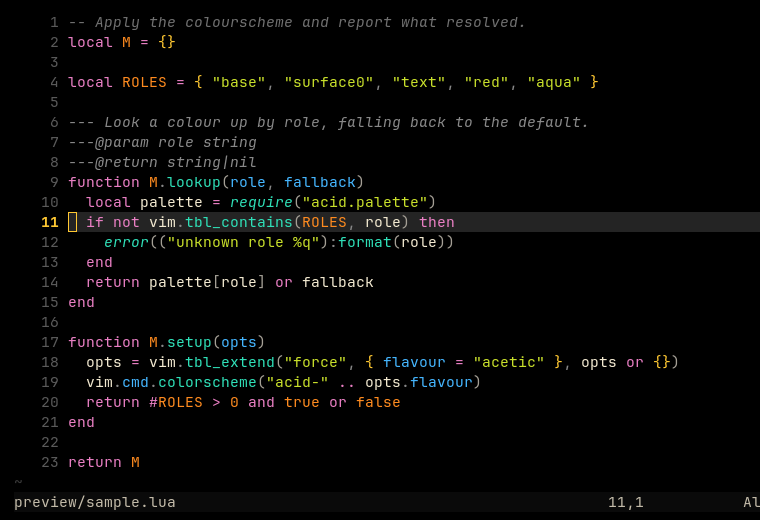
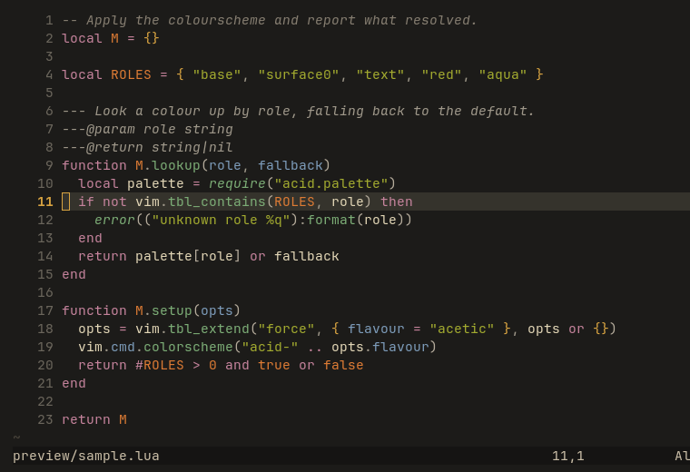

# Acid for Neovim

Two flavours: **Acetic** (`#000000`), vibrant, and **Citric** (`#1c1b19`), muted.

Part of [Acid](https://github.com/acid-theme/acid), a very dark colourscheme in two
flavours. The main README lists the other ports.

## Preview

| Acetic | Citric |
| --- | --- |
|  |  |

## Install

With Neovim's built-in plugin manager:

```lua
vim.pack.add({ { src = "https://github.com/acid-theme/neovim" } })
vim.cmd.colorscheme("acid-acetic")
```

With lazy.nvim:

```lua
{ "acid-theme/neovim", name = "acid", lazy = false, priority = 1000 }
```

Or without a plugin manager, by dropping `colors/acid-acetic.lua` into
`~/.config/nvim/colors/`.

Covers the editor and chrome groups, legacy syntax, every treesitter capture
Neovim documents, markup, diagnostics, diffs, spelling, `:terminal` and git
signs.

LSP semantic tokens link to the treesitter groups, so a language server cannot
repaint a buffer differently from the parser. Token modifiers are mapped too: a
read-only symbol is coloured as a constant, one from the standard library as a
builtin, and a deprecated one is struck through.

## Files

- `colors/acid-acetic.lua`
- `colors/acid-citric.lua`

## Generated

Acid 0.1.0, rendered by acidify from
[`ports/neovim/acid.lua.tera`](https://github.com/acid-theme/acid/blob/main/ports/neovim/acid.lua.tera).
Edits to these files are overwritten on the next release. Report issues on
[acid-theme/acid](https://github.com/acid-theme/acid/issues).

## Licence

MIT.
