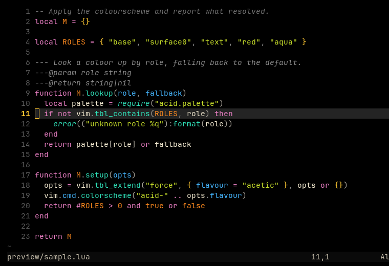
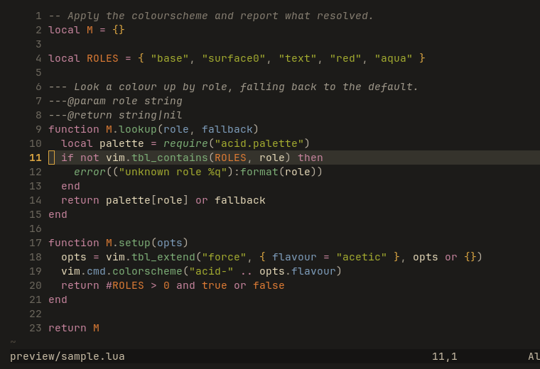
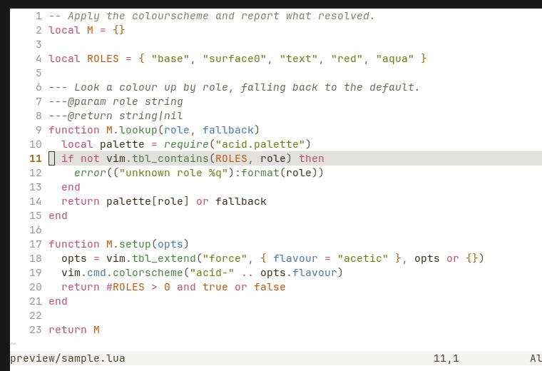

# Acid for Neovim

Generated from [acid-theme/acid](https://github.com/acid-theme/acid) — open issues
and pull requests there.

<details>
<summary>Screenshots</summary>

| Acetic | Citric | Lactic |
| --- | --- | --- |
|  |  |  |

</details>

## Install

With Neovim's built-in plugin manager:

```lua
vim.pack.add({ { src = "https://github.com/acid-theme/neovim" } })
vim.cmd.colorscheme("acid-acetic")
```

With lazy.nvim:

```lua
{ "acid-theme/neovim", name = "acid", lazy = false, priority = 1000 }
```

Or without a plugin manager, by dropping `colors/acid-acetic.lua` into
`~/.config/nvim/colors/`.

## Credits

[@ssiyad](https://github.com/ssiyad)
